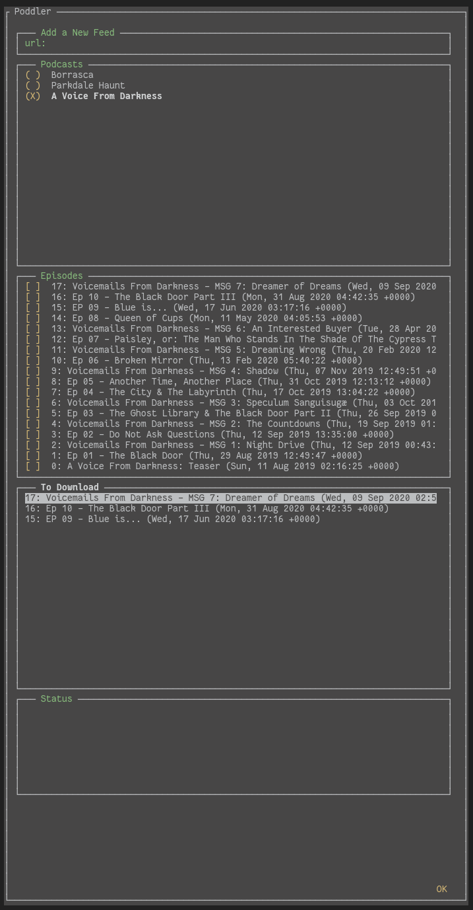

# Poddler
A podcast downloader.

## Built with
Python (feedparser, npyscreen, httpx)

## Installation
1. Clone repository.
2. pip install -r requirements.txt
3. python tui.py

## Screenshots

## Features
- Add rssfeed url.
- Delete podcast from database.
- Select and download episodes.

- Auto create folder based on podcast name.
- file downloaded are named based on an index and episode's title.

## Keybinding
Default npyscreen keybinding:
    Key Up/Down/Left/Right = Move around
    Ctrl+p = Previous block
    Ctrl+n = Next block
    x = select

Added keybinds:
    Ctrl+a = Depending on selected block.
                - Add url to database.
                - Select podcast.
                - Select episodes.
                - Download episodes. 
                
    Ctrl+d = on Podcast block, delete selected podcast from database.

## Status
In progress.
